# A2 – Truss Stress Analysis

## Truss Design

## Objective
The Objective of this assignment is to design and create a a 3D model of a truss and learn the steps of the design process involved. 

## Analyze
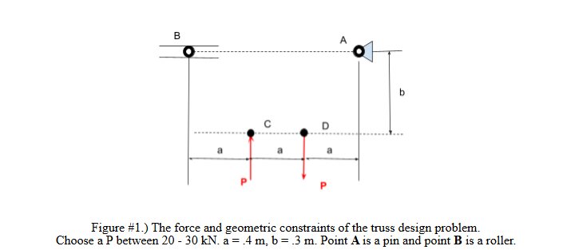

The truss needs to be able to support the 2 loads, which I chose to be equal to 20 kN. The distance between the members are given in vertical and horizontal distances and can be used to break forces into their x and y directions. A is a pin so it will have a vertical and horizontal reaction force. B is a roller so it will have a vertical reaction force.  

## Decide
I started my decision making process by sketching different ways to connect these 4 points making a truss. The three ideas i came up with were connecting points C and A, connecting points D and B, and connecting C and D to a midpoint on AB to create a symmetrical truss. 

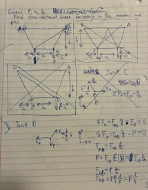

I originally decided to connect points C and A because then most of the reaction forces would be in pin A, but after I started drawing a free body diagram I realized there would be more forces acting at A than anywhere else so I decided on the one that connects points B and D to make the math simpler. 

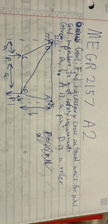

## Communicate

After deciding how I was going to design the truss the next step was to solve for the internal loads of the beams. The first step was drawing the free body diagram for each joint and symbolically solving for the unknown internal loads. This was done by setting all forces in the x and y directions equal to 0 then and using the ratio of vertical/horizontal distance to break down forces that do not lie on those axis.

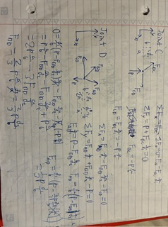
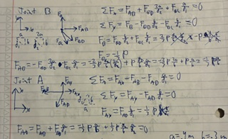

After solving for the values symbolically I was able to get all the internal forces in terms of P, a, b, d1, and d2 which are given (d1=sqrt(a^2+b^2) and d2=sqrt(4a^2+b^2)) and solve numerically.

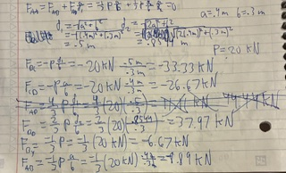
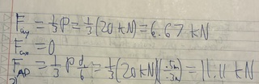

After finding the internal loads the next step is to determine the size of the beams necessary to support the loads and the weight of the truss. The problem said the truss would be made of A 500 structural steel with uniform area so I used a table on https://beamdimensions.com/materials/Steel/ASTM/ASTM_A500/ to find its properties, the safety factor is 3.5 and the largest internal load is 37.97 kN. There were multiple values dependent on the grade, I decided A is probably cheapest and used those table values for yield strength and density. The first step in this process was to symbolically solve for the minimum cross section area (we already did it in class so that step is at the bottom of the page), then plug in my values and numerically solve for it. For the force I used the largest internal load, because this member is most likely to break. To determine the weight of the truss the equation is area * length * density * gravity constant. Because all the members have the same area, density, and gravity constant I solved this by plugging the total length of all the beams into the equation rather than finding the weight of every beam. 

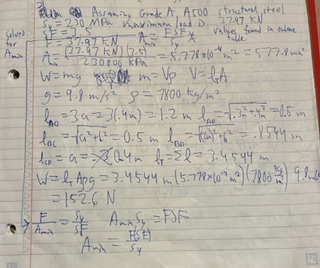

The final step in solving this problem is to determine the necessary size of the pins that will be holding the truss together. First I had to find the pin that would have the greatest shear force applied to it. I did this by drawing a free body diagram for each pin with equal and opposite forces pushing along the axis. The values of the forces were determined by which ones were acting solely in the positive/negative x and y direction and knowing the opposite equilibrium force would have an equal magnitude. 

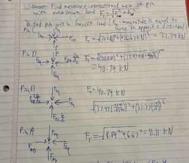

Yield shear strength, safety factor, and density were all given so I solved the shear stress equation for area symbolically. the value for yield strength was in incorrect units so I first used google to convert my value to correct units then plugged in my numbers and numerically solved for the cross sectional area. 

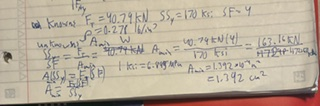

After finding area the final task was to find the weight of all the pins combined. This used the same equation as the weight of the beams the only value I didn't have was the length of the pins so I googled how long a truss pin is and I found an equation for slenderness ratio that says the pin should be no more than 3 times as long as the its diameter, in this case the length should be less than 3.99 cm. After finding that value I was able to find the weight of 1 pin I then multiplied that value by 4 because there will be 1 pin at each joint. 

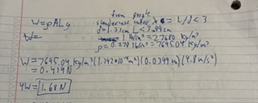

To model the truss in solid works I started by drawing 4 circles with the beam diameter as their diameter and spaced with the same dimensions as points A, B, C, and D in the problem. After the points were made i drew lines connecting them so the model's shape would match my sketch. Next I added holes in the center of all my points to have the same diameter as my pin. Lastly I extruded the sketch 3.99 cm to match my pin length. After I had a 3-D truss I changed the material properties. A500 structural steel was not an option so I had to manually configure the properties to do that I copied the plain carbon steel properties and created a new material folder for A500 and edited the properties so they matched the grade A properties I found online. The predicted weight for the truss in SolidWorks is 128.45 N. The pin was easier to make just a circle with a 1.33 cm diameter extruded 3.99 cm. I had to complete the same process for the mass properties, this time I copied tool steel and edited only the yield strength and density because they were given. The predicted weight for 1 pin is .4181 N so 1.672 for all 4 pins and the combined weight of the truss and the pins is 130.12 N

[Download Truss](../A02/A2Truss.SLDPRT)

[Download Pin](../A02/A2Pin.SLDPRT)

## Individual Beam Analysis

Using the equation stress = force / area with the largest load would give me the largest stress as 65.7 MPa which is much smaller than this materials tensile and yield strength, also this material is ductile (from google AI) and will continue to go through plastic deformation after reaching its yield strength so none of the beams should fracture. Also after performing all the math it is clear member BD is over stressed and causing large reaction forces on the members that are in contact with it. The best way for me to fix this I think is to add a beam connecting A somewhere to member BD probably closer to point D because it is being pulled down so this member will help support that negative force. 

Member AB is under compression so it is most likely to fail from buckling. 

Member AD is being pulled so it would most likely to fail from yielding.

Member BC is under compression so it is most likely to fail from buckling.

Member BD is being pulled so it is most likely to fail from yeilding.

Member CD is under compression so it is most likely to fail from buckling.

The Pin connections will most likely fail from the shear forces and not bending because it is hardened tool steel it is hard and brittle and not ductile so it chips and cracks but will not bend easily. The article I read went on to talk about this being because of the elastic strains created while treating the metal so its strength is greater but it yeilds and fractures at a smaller strain value. https://www.imetllc.com/tempering-steel-why-temper-through-hardened-steel/

While completing this assignment I was able to learn about the importance of material selection in design. The physics involved with statics and solids is mostly straight forward the problem solving aspect for an assignment like this is involved in making the truss with the right materials so no one is endangered and we are not using unnecessarily strong material that will waste money.
