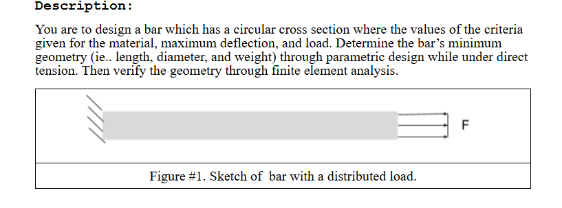
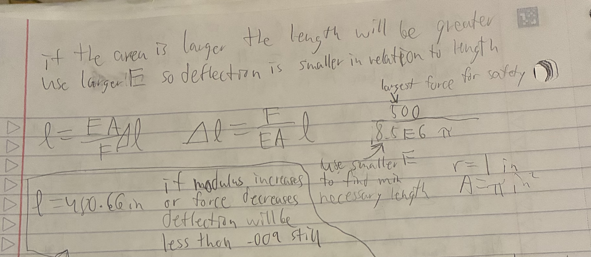
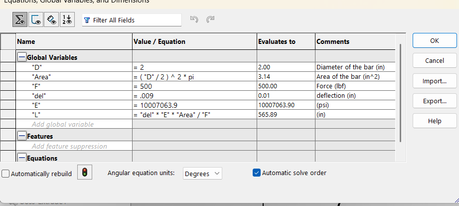
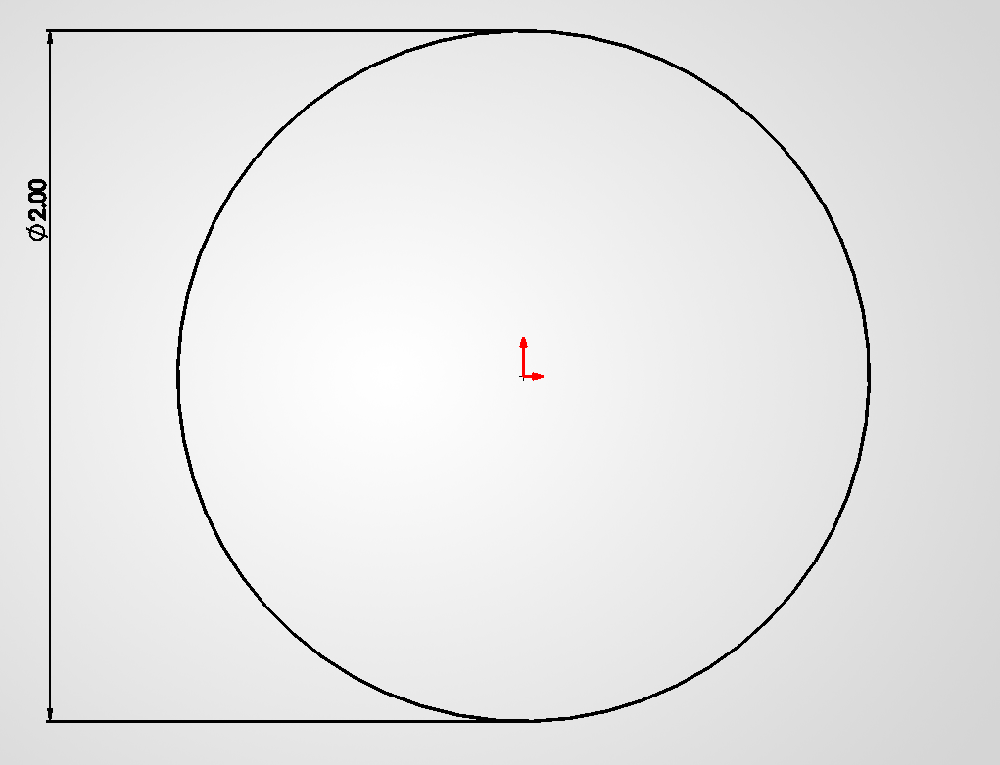
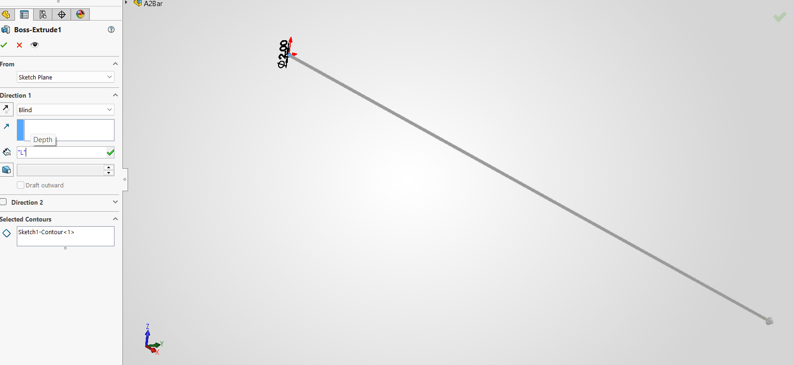
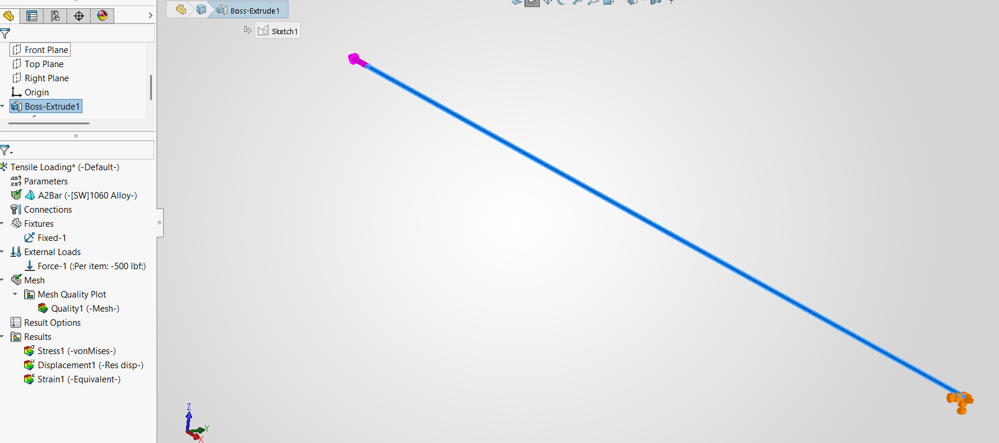
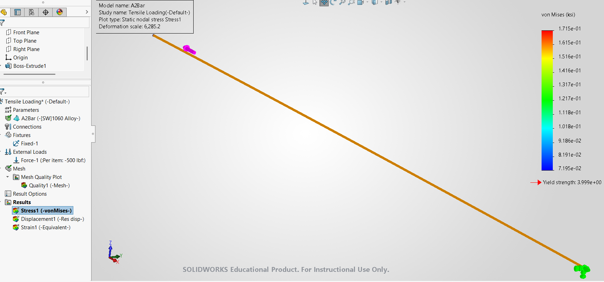
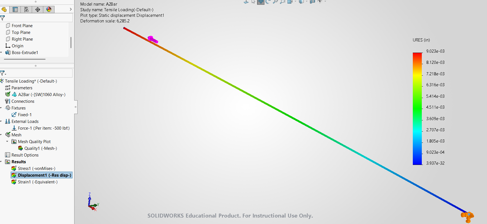
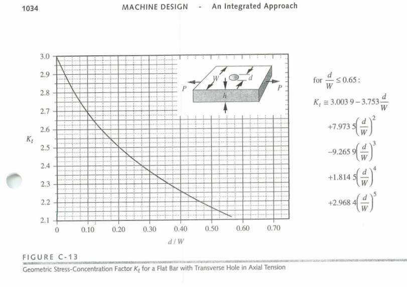
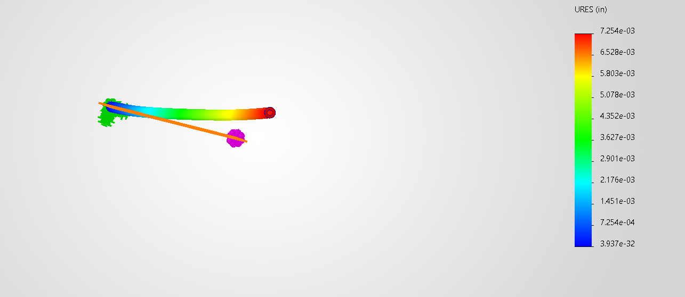

# A3 – Parametric and FEA

## Objective
The Objective of this assignment is to use parametric design to model a bar and conduct FEA on it. It is then possible to compare the results of the to types of design.

## Analyze

The bar that is designed should have a circular cross-section, receives an applied axial load between 300 and 500 pounds of force, and cannot deflect more than .009 inches. The bar is to be made from aluminum with a Youngs Modulus between 8.5x10^6 and ll.5x10^6. The area of the bar can be decided by me and this will allow me to find the length of the bar I am designing. I will then conduct FEA on the bar in Solidworks and compare the computers results with my hand calculations. I can then conduct FEA on the bar testing different loads and cross-sectional areas and compare those results.

## Decide

Since I don't know what this bar is going to be used for other than practice with Solidworks I'm going to make its radius 1 inch and area of the circular cross section pi inches squared to simplify the math. Next is to find the length of the bar using the given equation for Young's Modulus. Using this equation, if area is constant, deflection will increase proportionally with length at a rate of F/E so to find the length of the bar I am going to use the smallest Young's Modulus and largest force for the ranges given. The length i found was a little more than 480 inches. Once I began modeling the bar I found the modulus for the aluminum I chose was actually around 10x10^6 so the length of my bar increased. 

## Communicate
I began my modeling by drawing a circle and using my global variable for diameter to dimension it.

I then extruded it to the calculated length from my parameters.

I then created my simulation having a fixture on one end of my bar to hold it in place and a tensile 500 pound force applied to the opposite face. I then created a mesh and ran the study to produce Von Mises, strain, and displacement charts. The max stress in the Von Mises is 0.1715 ksi which is about 20 times smaller than its yield strength (I'm using the Sy=4 ksi in solid works not the Sy=40 ksi given in the assignment) so I have a safety factor of 20.

After conducting the FEA I found that the computers value and my value for displacement were about the same with a 0.255% difference, my hand calculations were .009 inches and the computers were .009023 inches. I would expect these two values to be as close as they are because the force is applied to only one face and the geometry is simple, so very few assumptions are made. While hand calculations would work, I trust the computer's calculations more for this assignment because the computer takes into account certain factors such as strain displacement within the bar. 

If there were a pin hole in this bar it would cause it to fail the safety factor because after looking at the stress concentration factor for a a flat bar with a hole, the stress concentration factor would be larger in a round bar because W decreases above and below its centerline. I would estimate the concentrated stress at the whole would be around 0.60 ksi which is about 7 times smaller than the yield strength 4 ksi.

Before I begin changing values I am assuming since the modulus of elasticity is constant the bars displacement will increase proportionally with Force and increase inversely with the change in diameter.

After modeling and simulating the bar with different area and load I found that displacement decreased when I decreased the load from 500 pounds to 300 pounds and displacement increased when I put a hole in my part decreasing its cross-sectional area. Something I didn't expect to happen is my part had displacement along both axis perpendicular to the force. 

During this assignment I learned the usefulness of finite element analysis as a tool for predictive modeling to figure out how parts will function under loads in the real world. The biggest mistake I made was not taking pictures as I was completing my cad works so I had to go back and re do my work to obtain documentation.

This assignment took about an hour of hand calculations, about 2 hours to learn the CAD, complete it myself and cycle through different parameters to understand how they interact physically, and about 1.5 hours to document my processes and redo my CAD for a total of about 4.5 hours.
