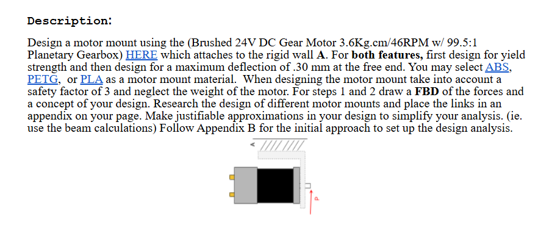
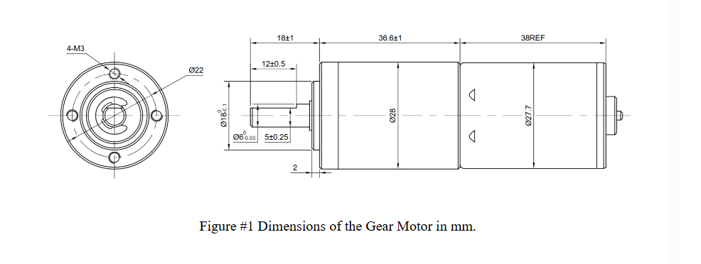
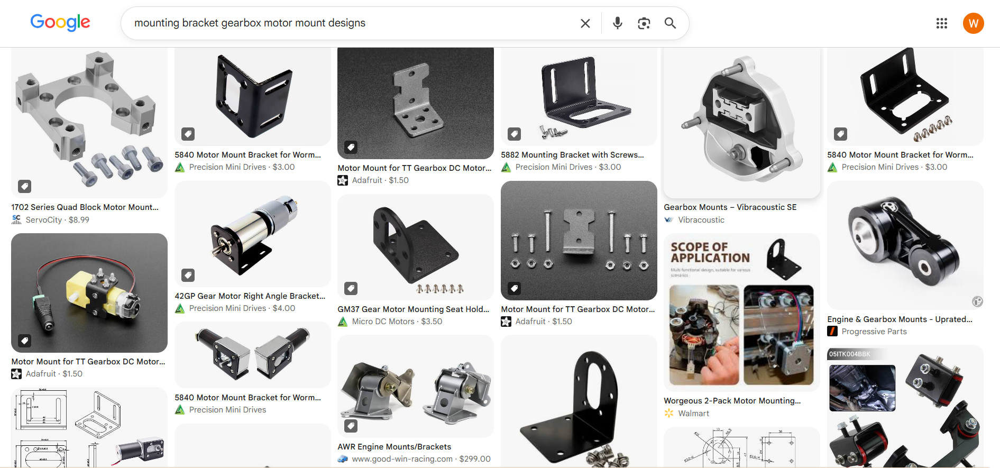
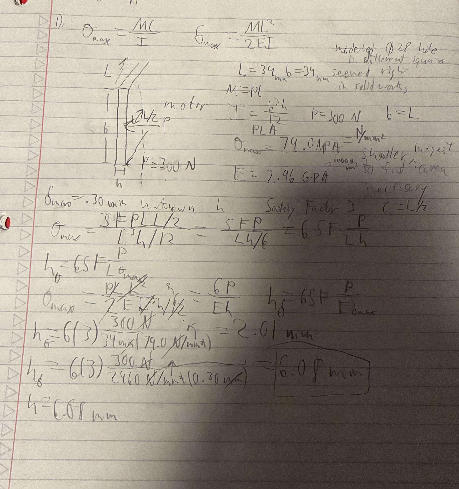
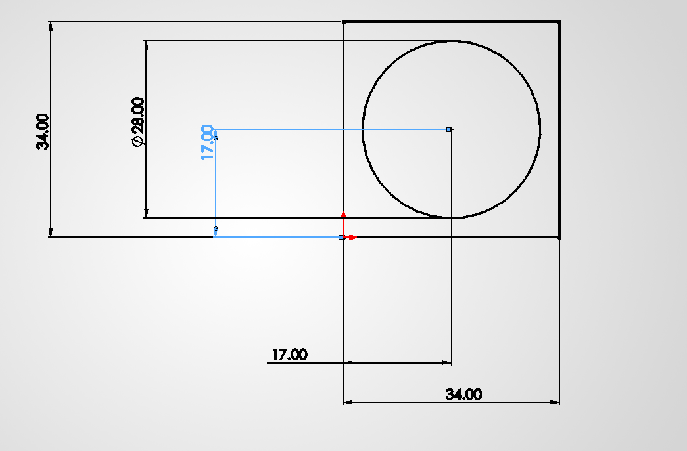
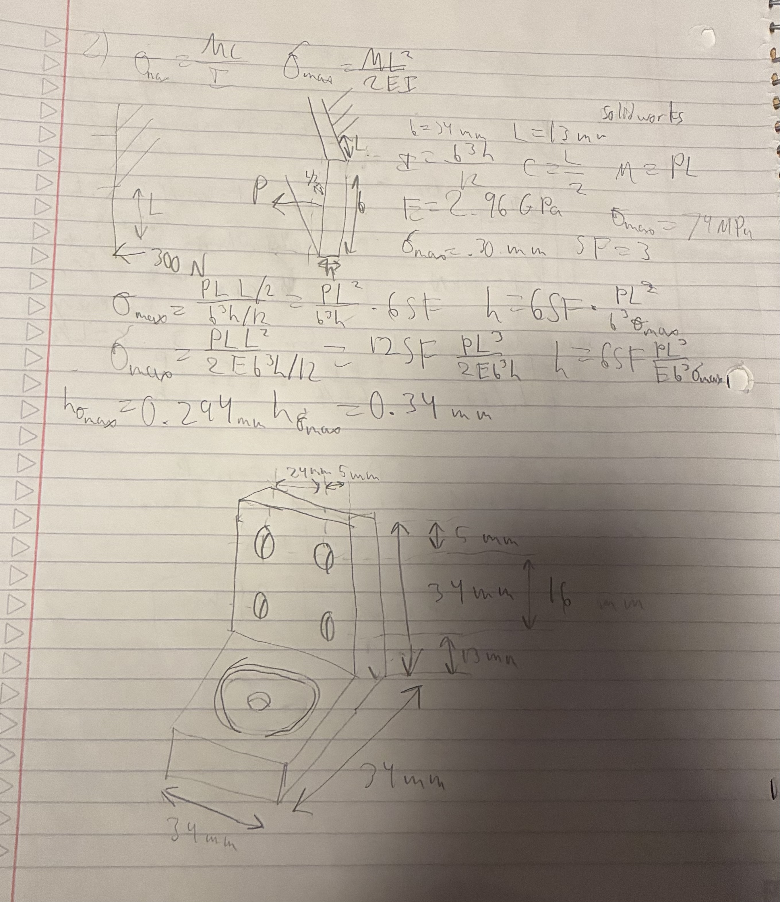
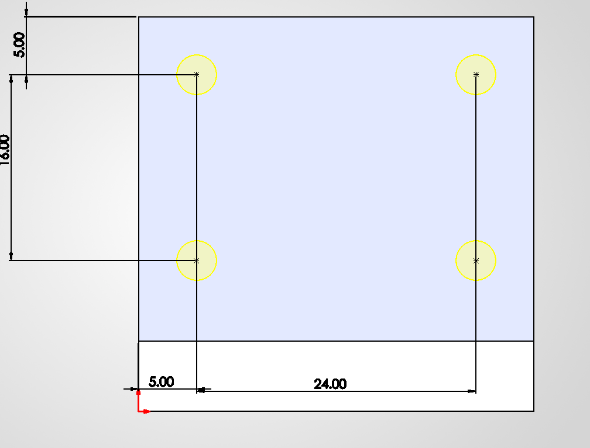

# A4 – Motor Mount.

## Objective
Use parametric design to model a motor mount in CAD. 

## Analyze

For this assignment we are tasked with creating a motor mount that is made of two features one that connects to a wall and another that connects to a Brushed 24V DC Gear Motor 3.6Kg.cm/46RPM w/ 99.5:1 Planetary Gearbox (dimensions shown above). The feature with the motor attached will have a force applied that cannot exceed to material max stress and cannot cause the feature to deflect more than 0.30 mm. The material can be PLA, ABS, or PETG

In order to research motor mounts I googled "mounting bracket gearbox motor mount designs" and found a lot of images that gave good layout for my design.

## Decide

For this assignment I chose PLA as the material because it is cheapest and should suffice as a support material. When I followed the given link to [MatWeb](https://www.matweb.com/search/DataSheet.aspx?MatGUID=ab96a4c0655c4018a8785ac4031b9278&ckck=1) I found the flexural yield strength is equal to 79-93 MPa and a flexural modulus equal to 2.96-3.6 GPa. I will use the smaller values when modeling because I need to find min cross-sectional area necessary and smaller strength and modulus will will produce larger values.

## Communicate

### Figure 1

The first step to figure 1 was listing knowns and unknows to solve the equations at the top of my page. There were some values that were up to my discretion so I decided the length of the beam would equal the length of its cross-sectional area and chose 34 mm after doing a quick check in solid works to see what dimensions would look right with a 28 mm diameter indent.

Once I had all my knowns and unknowns listed I could plug variables into my equation and solve symbolically for the min required h value to support the max stress and max deflection. after solving I found h would need to be 2.01 mm to support the max stress and 6.08 mm to prevent more than 0.30 mm of deflection so my h value is equal to 6.08 mm 

### Figure 2

For figure to I had the same values except with the same freedoms except L would need to be shorter because only a portion of figure 2 is able free to bend.
I kept b the same a similar to above used solid works to see about how far the bolt holes should be from the edges to pick an L value.

### Appendix 
[Example Mounts](https://www.google.com/search?q=mounting+bracket+gearbox+motor+mount+designs&sca_esv=326e45127ec9a721&rlz=1C1VDKB_enUS959US967&udm=2&biw=1536&bih=730&sxsrf=APpeQns8jFo_-obYn5SgVI46MUhmRigk2Q%3A1789612536919&ei=-FGras_dN7G_p84PrNzD-Ak&ved=2ahUKEwjPubGcyvSWAxWx38kDHSzuEJ8Q4dUDegQIBhAN&uact=5&oq=mounting+bracket+gearbox+motor+mount+designs&gs_lp=Egtnd3Mtd2l6LWltZyIsbW91bnRpbmcgYnJhY2tldCBnZWFyYm94IG1vdG9yIG1vdW50IGRlc2lnbnNI0jBQwg5YgC1wAXgAkAEAmAFUoAHuBqoBAjExuAEDyAEA-AEBmAIAoAIAmAMAiAYBkgcAoAeEAbIHALgHAMIHAMgHAIAIAQ&sclient=gws-wiz-img)
