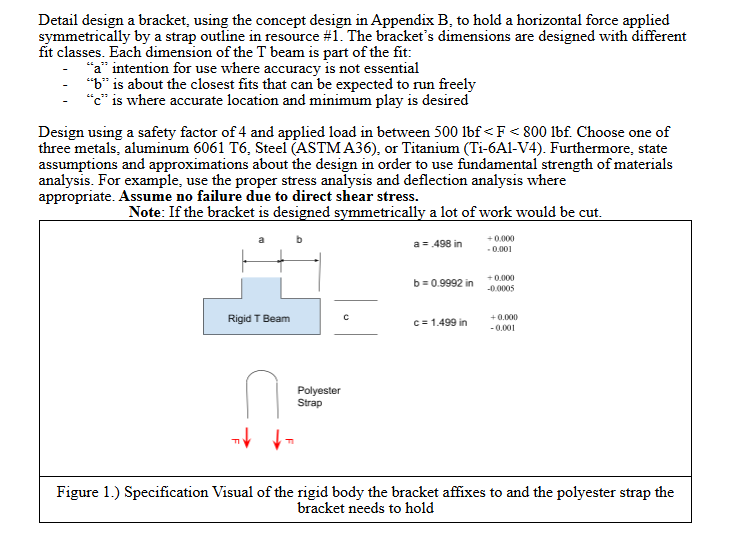
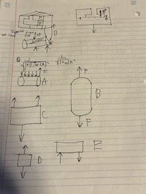
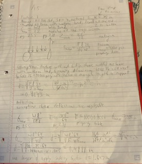
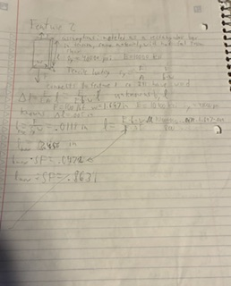
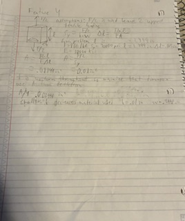
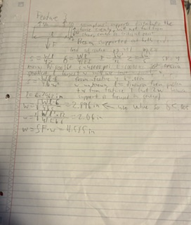
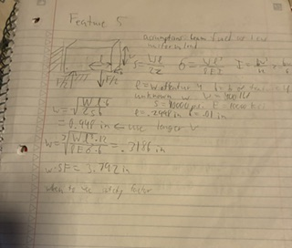
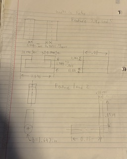
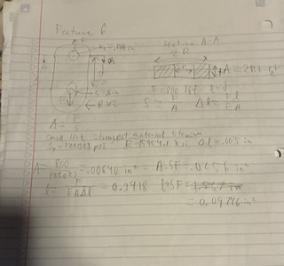

# A5 – Bracket Design

## Objective
The objective of this assignment is to:

Conduct stress and stiffness analysis to determine appropriate dimensions for structural features. 

Compare stress and stiffness analyses to ensure structural integrity and compliance with given constraints.

Create detailed multiview sketches illustrating dimensions derived from both stress and stiffness analyses.

Reflect on and document key engineering lessons learned throughout the process.

## Analyze

For this assignment i was tasked with designing a bracket that attaches a hook to a the wall using a t-shaped insert. For this problem we are given the dimensions of the insert and the applied force so we will need to find the dimensions of the bracket necessary to support the applied load with one of the three given materials (the breaket will not break because of shear stresses). This will be a small part so using aluminum would be best because it is easier to manufacture aluminum parts. The first step was creating a rough idea of the bracket and breaking it up into individual features. 

## Decide
### Feature 1
Feature one could be modeled as a beam with uniform load fixed at one end. Another assumption is that a length of .75 inches is enough to support the strap based off its dimensions. I was then able to use The Machineries Handbook, pgs 255 and 238 respectivley, to find equations for stress and deflection, and moment of inertia and section modulus. I then was able to find yield strength and Young's modulus on online table. Once I knew Load = 800 lbf, length = 0.75 in., and yield strength = 40000 psi. I could solve the minimum necessary diameter to support the force. Solving for diameter based on stress I then solved based on max deflection. The known values were Load, length, max deflection = .005 in., and Young's Modulus = 10000 ksi. After solving the deflection equation I found the necessary diameter was smaller so I used my first value diameter = 0.4243 in. and multiplied by my safety factor of 4. 

### Feature 2 
I assumed feature 2 could be modeled as a bar in tension I also assumed it would be make the most sense for the width of the bar to be equal to the diameter of feature 1. Using the equations for stress and deflection of a bar under tensile force I was able to solve for thickness with my known values F = 800 lbf, s= 40000 psi, and w = 1.697 in. I found the bar would need to be 0.0118 in thick to support the load then multiplied by my safety factor to find necessary thickness of .0472 in. Next I used my value for thickness to solve for necessary length which depends on it. Using the deflection equation where E = 10000 ksi i found the longest this bar could be is 3.45 in, I then divided by my safety factor to find the necessary length is 0.8631 in. 

### Feature 4 
I started designing the nest parts from the middle because the length of this feature is fixed if I want a good fit and the dimensions of this feature will affect the dimensions of both feature 3 and 5. I also assumed this could be modeled as a bar in tension. This one gave me slightly more freedom because stress and deflection are dependent on area and because it is rectangular shaped I can change width and thickness. I solved for area using both equations with the given values load = F/2 = 400 lbf (there are one of these on each side of feature 3 so the load gets split between them), s = 40000 psi, E = 10000 ksi, l = 1.499 (from size of T insert), and deflection = .005 in. I would need .01199 in^2 of area to support the stress which was the larger of my 2 values. I then made a mistake and divided by my safety factor instead of multiplying so my values are going to be a little strange for the rest of these features. The necessary area after applying my safety factor is .002998 in^2 and in order to reduce material I want to minimize the thickness because that is shared throughout the material. So I set my thickness to .01 in and found the necessary width to be .2998 in. 

### Feature 3
Feature 3 I assumed could be modeled as a beam supported at both ends with a load at the center and was able to find stress and deflection equations on page 251 of the machineries handbook and equations for moment of inertia and section modulus on page 236. I was able to define the length and thickness using values found on feature 4 and the insert dimensions. l = a+2b+width of 4 where a + 2b gives me the length of the insert this beam spans and the width from 4 because the support would be focused in the center of the 2 feature 4s. With the known values F = 800 lbf, s = 40000 psi, E = 10000 ksi, deflection = .005 in, thickness = .01 in, and l = 2.7962 in, I could solve both equations for the height of the beam and use the larger value for necessary height. I found I would need 2.896 in to support both stress and deflection when multiplied by my safety factor and found the height would need to be 11.585 in.

### Feature 5
For feature 5 I assumed it could be modeled as a beam fixed at one end with a uniform load because this feature experiences the downward force from feature 4 which is covering that entire face, and I assumed I could model the other end as fixed because the symmetry in its design prevents rotating about the T shaped insert. I was also able to use the width of feature 4 to model this beam's length and the thickness was also reused. My known values for these equations were l= .2998 in, thickness = .01 in, F = 400lbf, s = 40000 psi, and E = 10000 ksi. After solving the stress and deflection equations for the height of the beam I found it would need to be .948 in tall and 3.792 in after applying my safety factor

### Sketches

### Feature 6 
The link that goes at the bottom of feature 1 could be modeled as a bar in tension with the holes taken into account when calculating cross sectional area. For mine the side attached to the bracket would have less area because that hole is larger. I decided this would be better made out of a stronger material like titanium because it will be so small. My known value are F = 800 lbf, s = 125023 psi, E = 159541.1 ksi, and deflection = .005 in. I then solved for the cross sectional area which has to .00640 in^2 and .0256 in^2 with my safety factor. And the length would need to be .3918 in and .09796 in with my safety factor. 

## Communicate
For feature 3 I found I had to compare to different cross sectional dimensions because other values were set. The values were 2.896 in for stress and 2.06 in for deflection which is a substantial difference for the total size of my part. I would guess this has to do with multiple supports creating internal moments that put stress on the beams molecular connections so it will fracture before it deforms from bending. I had many values carry over from one feature to the other the most noticeable was the thickness of the bracket which because I had made so small is going to make my finally unusually tall compared to its other dimensions, because this value was used when calculating cross sectional area. My least accurate assumption I think was minimizing the thickness to reduce material this caused my piece to be much larger than I was expecting and not a compact wall hanger. I still think I had the right idea just very poorly executed, I went to far to the extreme. 

### Fits

"Macheenineries Handbook" pg 653
For the feature 1 hole I would want a RC1 fit because the length of the shaft is pretty small and this would make it more difficult for the link to move while on it. For the 1 inch whole I would want an LT1 fit because this would make it unlikely the fit would be loose but it still should not require too much pressure to secure the 2 items. The best manufacturing process for this would probably be casting because of its small size but it could maybe be machined if the metal could be well secured, probably not because of how thin it is though.

### Property Tables

